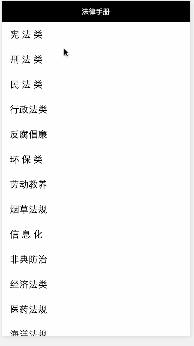

###微信小程序体验
学习了别人的源码，感谢分享：https://github.com/zarknight/qlaw

简单法律手册，使用微信小程序俱乐部(http://www.wxappclub.com/)的接口进行数据模拟

1、使用wx.request来请求数据

2、this.setData来保存数据

3、onLoad:function(params)，params是接收页面传过来的数据

###效果图

###模拟数据
由于是模拟数据，只模拟了最上面一条的数据

type | key | value
----|----|----
qlaw-getLawTypes | types | [{"name":"宪 法 类","id":"1"},{"name":"刑 法 类","id":"2"},{"name":"民 法 类","id":"3"},{"name":"行政法类","id":"4"},{"name":"反腐倡廉","id":"5"},{"name":"环 保 类","id":"6"},{"name":"劳动教养","id":"7"},{"name":"烟草法规","id":"8"},{"name":"信 息 化","id":"9"},{"name": "非典防治","id":"10"},{"name":"经济法类","id":"11"},{"name":"医药法规","id":"12"},{"name":"海洋法规","id":"13"},{"name":"劳动法类","id":"14"},{"name":"知识产权类","id":"15"},{"name":"新闻出版类","id":"16"}]
qlaw-getLawsByType | 1 | {"laws":[{"name":"中华人民共和国宪法","pdate":"2004年3月14日","id":"1"},{"name":"中华人民共和国宪法修正案","pdate":"1999年3月15日","id":"2"},{"name":"中华人民共和国戒严法","pdate":"1996年3月1日","id":"3"},{"name":"中华人民共和国国务院组织法","pdate":"1982年12月10日","id":"4"},{"name":"中华人民共和国香港特别行政区驻军法","pdate":"1996年12月30日","id":"5"},{"name":"中华人民共和国民族区域自治法","pdate":"2001年2月28日","id":"6"},{"name":"中华人民共和国立法法","pdate":"2000年3月15日","id":"7"},{"name":"中华人民共和国国家安全法","pdate":"1993年2月22日","id":"8"},{"name":"中华人民共和国国徽法","pdate":"1991年3月2日","id":"9"},{"name":"中华人民共和国国旗法","pdate":"1990年6月28日","id":"10"}]}
qlaw-getLawById | 1 | {"name":"中华人民共和国宪法","desc":"1982年12月4日第五届全国人民代表大会第五次会议通过1982年12月4日全国人民代表大会公告公布施行","preface":"中国是世界上历史最悠久的国家之一。中国各族人民共同创造了光辉灿烂的文化，具有光荣的革命传统。","chapters":[{"name":"第一章 总 纲","entries":[{"name":"第一条","content":"中华人民共和国是工人阶级领导的、以工农联盟为基础的人民民主专政的社会主义国家。"},{"name":"第二条","content":"中华人民共和国的一切权力属于人民。"},{"name":"第三条","content":"中华人民共和国的国家机构实行民主集中制的原则。"}]},{"name":"第二章 公民的基本权利和义务","entries":[{"name":"第三十三条","content":"凡具有中华人民共和国国籍的人都是中华人民共和国公民。"},{"name":" 第三十四条","content":"中华人民共和国年满十八周岁的公民，不分民族、种族、性别、职业、家庭出身、宗教信仰、教育程度、财产状况、居住期限，都有选举权和被选举权；但是依照法律被剥夺政治权利的人除外。"},{"name":"第三十五条","content":"中华人民共和国公民有言论、出版、集会、结社、游行、示威的自由。"}]},{"name":"第三章 国家机构","entries":[{"name":"第五十七条","content":"中华人民共和国全国人民代表大会是最高国家权力机关。它的常设机关是全国人民代表大会常务委员会。"},{"name":" 第五十八条","content":"全国人民代表大会和全国人民代表大会常务委员会行使国家立法权。"},{"name":"第五十九条","content":" 全国人民代表大会由省、自治区、直辖市、特别行政区和军队选出的代表组成。各少数民族都应当有适当名额的代表。"}]}]}

###注意
在wx.request返回success成功后使用this.setData报错这是由于this指向问题，在wx.request外面设置var that = this,然后就可以愉快地在success里使用this.setData了。

